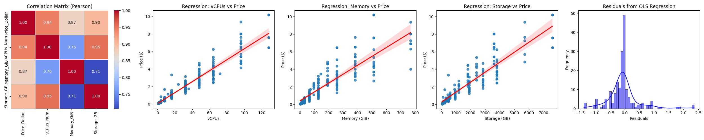

# Computing resource price study

Price study for various computing resources.

# Cloud resources



Based on an analysis of EC2 price data, the correlation of price, vCPUs, memory, storage, and network bandwidth correlates as shows in the figure above.

OLS regression gives:

```
                                 OLS Regression Results                                
=======================================================================================
Dep. Variable:           Price_Dollar   R-squared (uncentered):                   0.974
Model:                            OLS   Adj. R-squared (uncentered):              0.973
Method:                 Least Squares   F-statistic:                              2256.
Date:                Mon, 17 Feb 2025   Prob (F-statistic):                   3.09e-144
Time:                        12:56:00   Log-Likelihood:                         -141.41
No. Observations:                 186   AIC:                                      288.8
Df Residuals:                     183   BIC:                                      298.5
Df Model:                           3                                                  
Covariance Type:            nonrobust                                                  
==============================================================================
                 coef    std err          t      P>|t|      [0.025      0.975]
------------------------------------------------------------------------------
vCPUs_Num      0.0366      0.004      9.085      0.000       0.029       0.045
Memory_GiB     0.0043      0.000     14.294      0.000       0.004       0.005
Storage_GB     0.0001   7.08e-05      1.769      0.078   -1.44e-05       0.000
==============================================================================
Omnibus:                       74.583   Durbin-Watson:                   1.178
Prob(Omnibus):                  0.000   Jarque-Bera (JB):              343.508
Skew:                           1.473   Prob(JB):                     2.56e-75
Kurtosis:                       8.970   Cond. No.                         266.
==============================================================================
```

Resulting in a price of:

- $0.0366 per hour per vCPU
- $0.0043 per hour per GiB of memory
- $0.0001 per hour per GB of storage

Hence:

_0.0366 * 2 + 0.0043 * 4 + 0.0001 * 118_

Gives an estimate price of:

_$0.1022 per hour_

For:

| Instance   | Memory  | vCPUS   |Storage         | Bandwidth          | Price          |
|------------|---------|---------|----------------|--------------------|----------------|
| C6ID Large | 4.0 GiB | 2 vCPUs |118 GB NVMe SSD | Up to 12.5 Gigabit | $0.1008 hourly |

For an error of:

_$0.0014_