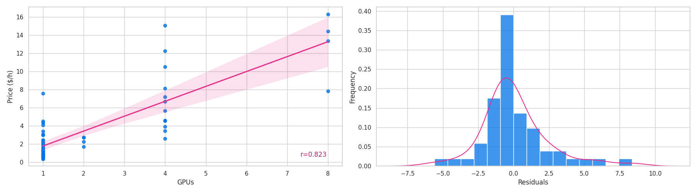

# Computing resource price study

Price study for various computing resources.

# Cloud resources


For non-GPU instances, based on an analysis of EC2 price data, the correlation of price, vCPUs, memory, and storage correlates as shows in the figure above.

OLS regression gives:

```
                                 OLS Regression Results                                
=======================================================================================
Dep. Variable:           Price_Dollar   R-squared (uncentered):                   0.980
Model:                            OLS   Adj. R-squared (uncentered):              0.980
Method:                 Least Squares   F-statistic:                              2884.
Date:                Wed, 09 Apr 2025   Prob (F-statistic):                   2.05e-147
Time:                        14:30:59   Log-Likelihood:                         -95.197
No. Observations:                 176   AIC:                                      196.4
Df Residuals:                     173   BIC:                                      205.9
Df Model:                           3                                                  
Covariance Type:            nonrobust                                                  
==============================================================================
                 coef    std err          t      P>|t|      [0.025      0.975]
------------------------------------------------------------------------------
vCPUs_Num      0.0426      0.003     12.786      0.000       0.036       0.049
Memory_GiB     0.0040      0.000     16.392      0.000       0.004       0.005
Storage_GB -1.832e-05   5.95e-05     -0.308      0.758      -0.000    9.91e-05
==============================================================================
Omnibus:                       64.400   Durbin-Watson:                   1.631
Prob(Omnibus):                  0.000   Jarque-Bera (JB):              276.133
Skew:                           1.331   Prob(JB):                     1.09e-60
Kurtosis:                       8.529   Cond. No.                         254.
==============================================================================
```

Resulting in a price of:

- $0.0426 per hour per vCPU
- $0.0040 per hour per GiB of memory
- $-1.832e-05 per hour per GB of storage

Hence:

_0.0426 * 2 + 0.0040 * 4 + -1.832e-05 * 118_

Gives an estimate price of:

_$0.09903824 per hour_

For:

| Instance   | Memory  | vCPUS   |Storage         | Bandwidth          | Price          |
|------------|---------|---------|----------------|--------------------|----------------|
| C6ID Large | 4.0 GiB | 2 vCPUs |118 GB NVMe SSD | Up to 12.5 Gigabit | $0.1008 hourly |

For an error of:

_$0.001761760000000001_



For GPU instances, a similar analysis gives us the contribution of the number of GPUs.

OLS regression gives:

```
                                 OLS Regression Results                                
=======================================================================================
Dep. Variable:           Price_Dollar   R-squared (uncentered):                   0.830
Model:                            OLS   Adj. R-squared (uncentered):              0.827
Method:                 Least Squares   F-statistic:                              264.1
Date:                Wed, 09 Apr 2025   Prob (F-statistic):                    1.89e-22
Time:                        14:33:42   Log-Likelihood:                         -123.43
No. Observations:                  55   AIC:                                      248.9
Df Residuals:                      54   BIC:                                      250.9
Df Model:                           1                                                  
Covariance Type:            nonrobust                                                  
==============================================================================
                 coef    std err          t      P>|t|      [0.025      0.975]
------------------------------------------------------------------------------
GPUs_Num       1.6760      0.103     16.253      0.000       1.469       1.883
==============================================================================
Omnibus:                       18.511   Durbin-Watson:                   1.630
Prob(Omnibus):                  0.000   Jarque-Bera (JB):               30.011
Skew:                           1.089   Prob(JB):                     3.04e-07
Kurtosis:                       5.890   Cond. No.                         1.00
==============================================================================
```

Resulting in a price of:

- $1.6760 per hour per GPU

Which is close to the mean prices:

- For non-GPU instances $2.0974
- For GPU instances $3.8166

That is, $2.0974 + $1.6760 gives $3.7733999999999996.