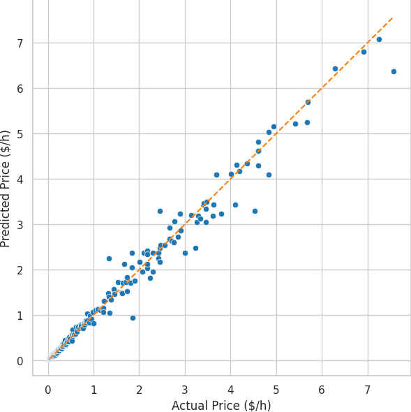

# Computing resource price study

Price study for various computing resources.

# Cloud resources

A random forest regressor is trained on EC2 on-demand pricing data (see _data/_). The dataset includes representative instance families across general-purpose, compute-optimized, memory-optimized, and accelerated categories. We remove outliers using an IQR filter over key attributes (vCPU, memory, storage, network bandwidth) to ensure model consistency.

The model learns price as a function of vCPUs, memory (GiB), storage (GB), network bandwidth (Gbps), and GPU count. It achieves an MAE of 0.13224, RMSE of 0.24759, and R^2=0.97925, indicating high fidelity in capturing EC2 pricing dynamics.

Figure: Predicted vs. actual EC2 prices (USD/hour). Dashed line indicates perfect prediction.

Figure: Distribution of residuals. Errors cluster tightly around zero, indicating stable predictive performance.